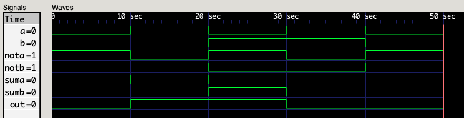

## Verilog HDL

An runtime of Hardware Description Language(HDL)

### Mac OS Instollation

```
$ brew install icarus-verilog
$ brew install homebrew/cask/gtkwave 
```

### Try it out

```
$ iverilog -o xor xor.v
$ vvp xor
$ open XOR.vcd
```

#### Truth Table

| a | b | out |
|---|---|---|
|0|0|0|
|1|0|1|
|0|1|1|
|1|1|0|

#### Test Result on gtkwave

